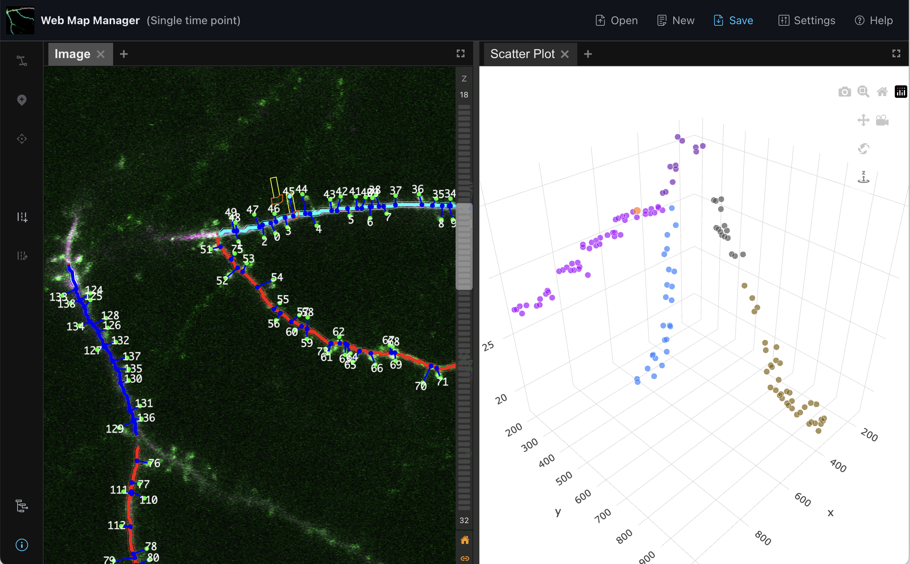

# WebMapManager

WebMapManager is a web based application built to provide the same functionality of [PyMapManager](https://github.com/mapmanager/PyMapManager). It provides a plugin based architecture for visualizing and analyzing time-series annotations and 3D image volumes, making it highly customizable and extensible. Designed for ease of use, WebMapManager is built with a modern interface that simplifies the distribution and adoption of the MapManager.



---

## Live Demo

Explore the live demo at [https://mapmanager.net/WebMapManager/](https://mapmanager.net/WebMapManager/).

---

## Table of Contents

1. [Project Structure](#project-structure)
2. [Setup](#setup)
3. [Running a Development Instance](#running-a-development-instance)
4. [Building WebMapManager](#building-webmapmanager)

---

## Project Structure

The WebMapManager project is organized into multiple packages to ensure modularity and extensibility:

### `packages/app`

- **Purpose**: The base application.
- **Features**:
  - Plugin system for extensibility.
  - Tab and shared state management systems.

### `packages/core`

- **Purpose**: Interlanguage interfaces and core functionality.
- **Features**:
  - Communication with the shared `MapManagerCore` Python package.
  - File loading and saving adaptors.

### `packages/image-view`

- **Purpose**: Image viewer plugin.
- **Features**:
  - Renders image slices.
  - Visualizes annotations.
  - Interactive editable annotations.

### `packages/scatter-plot`

- **Purpose**: Scatter plot plugin.
- **Features**:
  - Create 2D & 3D scatter plots.
  - Custom analysis axes and markers.

### `packages/table`

- **Purpose**: Table plugin.
- **Features**:
  - Displays raw data and derived analysis in a table.

### `packages/example-plugin`

- **Purpose**: Example plugin.
- **Features**:
  - Serves as a starting point for creating new controls, tools, or visualizations for WebMapManager.

---

## Setup

Follow these steps to set up the project for development:

1. **Initialize Git Submodules**:
   ```bash
   git submodule init
   git submodule update
   ```
2. **Install Node.js**:
   - Download and install Node.js from [nodejs.org](https://nodejs.org/en).
3. **Install Yarn**:
   - Install Yarn using npm:
     ```bash
     npm install -g yarn
     ```
4. **Install Dependencies**:
   - Install dependencies for the project:
     ```bash
     yarn install
     ```
5. **Install Python Dependencies**:
   - Install Python 3.11+.
   - Install the required Python packages:
     ```bash
     pip install -r requirements.txt
     ```

### Running a development instance

1. Run the server:

```bash
  yarn dev
```

2. Open [http://localhost:3000](http://localhost:3000) in the browser (tested on Google Chrome).

### Build WebMapManager

To build the static application for deployment:

1. Build the static application:

```bash
  yarn build
```

2. Upload the `/build/` directory to your static file server under `/WebMapManager/`.

3. **Optional**: To serve the application from a different directory:
   - Update the `base` property in `vite.config.ts`:
     ```js
     export default defineConfig({
       base: "/your-directory/",
       ...
     });
     ```
